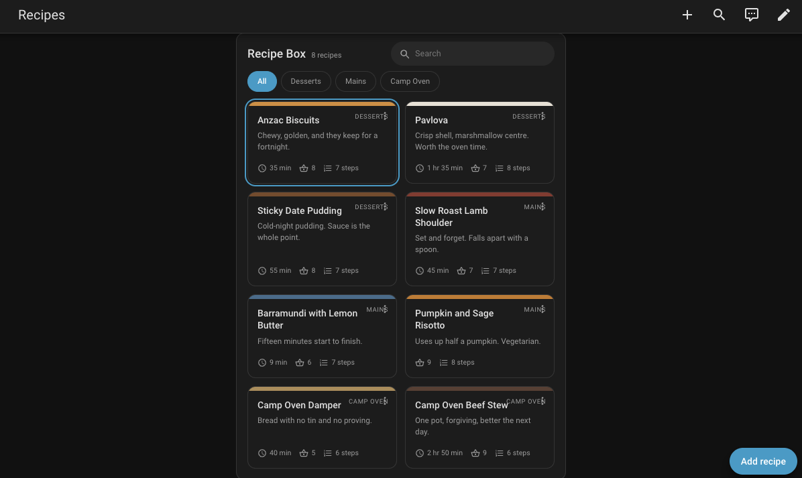
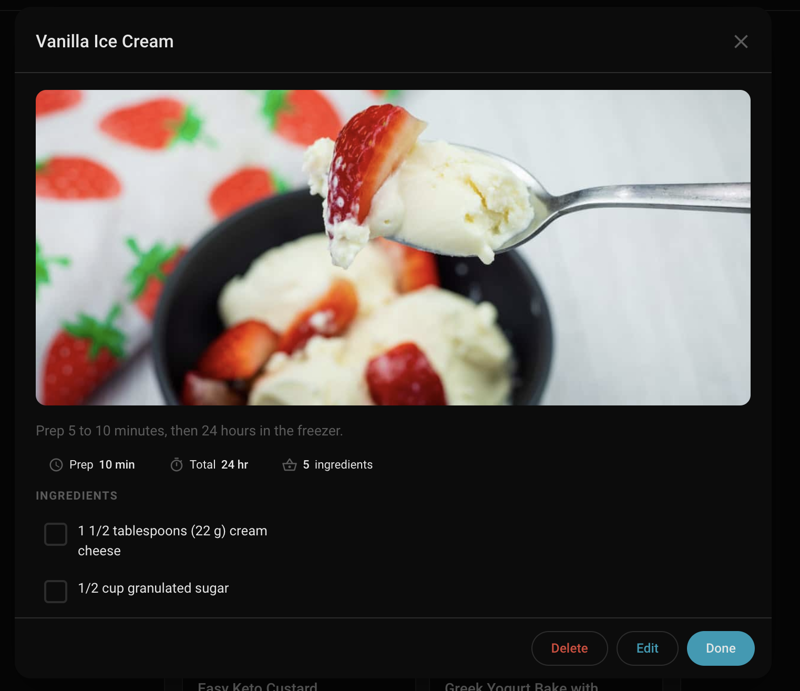
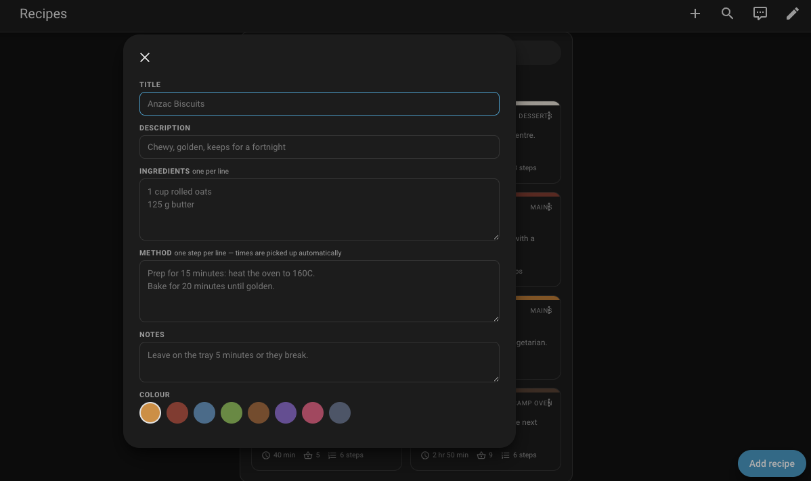

# RecipeCards - Recipe Management for Home Assistant

[](LICENSE)
[](https://github.com/custom-components/hacs)
[](https://github.com/ClermontDigital/RecipeCards)

Retro-style recipe card management for Home Assistant. Store, browse, and display recipes in a classic 80s-inspired card interface with flip animations and persistent storage.

## Features

- 📝 **Recipe storage** - title, description, ingredients, method, notes, photo and times, stored in Home Assistant itself. No container, no database, no cloud.
- 🏷️ **Tags** - a recipe can carry as many as you like, so a slow cooker brisket is both a main and a slow cook. The card's filter chips are tags, ordered by how often each is used.
- 📸 **Photos** - a link on each recipe, shown on the tile and as a header in the dialog.
- ⏱️ **Times picked up automatically** - write "Bake for 20 minutes" in the method and it becomes the cook time. Anything you set explicitly wins.
- ✅ **Cook from it** - ingredients and method tick off as you go, remembered per recipe.
- 📥 **Import from Mealie and Mela** - see [Importing](#importing-from-other-apps).
- 🔒 **Admin only editing** - everyone else gets full read access, so the dashboard can be shared with the household.
- 🔄 **WebSocket API** - the card reads recipes over it, so the sensors stay small no matter how many you have.
- 🚀 **HACS ready**

## Screenshots

**Recipe collection.** Every section in one place, with search and section tabs. Each tile carries a
photo, the total time, the ingredient count and the step count, so you can pick something without
opening anything.



**Opening a recipe.** It opens in a dialog, so the grid stays where it was and there is nothing to
navigate back from. Ingredients and method tick off as you cook, and the ticks are remembered per
recipe. Edit and Delete are admin only.



**Adding a recipe.** Ingredients and method are one item per line. Times written into the method,
such as "Prep for 15 minutes" or "Bake for 20 minutes", are picked up automatically, and the image
field takes a link to a photo.



## Quick Setup

### Requirements
- Home Assistant 2024.7+ (the card is served via `async_register_static_paths`)
- HACS (Home Assistant Community Store)

### Installation
1. **HACS**: Add custom repository `https://github.com/ClermontDigital/RecipeCards`
2. **Manual**: Download and extract to `/config/custom_components/recipecards/`
3. Restart Home Assistant
4. Add integration via Settings → Devices & Services

### Lovelace Card Auto-Loading
The bundled buildless card is served from `/recipecards/recipecards-card.js` and loaded into the
frontend automatically - you do **not** need to add a Lovelace resource on storage dashboards. A
version parameter is appended (e.g. `/recipecards/recipecards-card.js?v=1.9.0`) to bust browser
caches after an upgrade.

If static path registration is unavailable, the integration falls back to copying the file into
`/config/www/` and loading `/local/recipecards-card.js`. Exactly one URL is ever loaded, so the
custom element is never defined twice.

### Configuration
1. **Add RecipeCards Integration (Multiple Sections Supported):**
   - Go to Settings → Devices & Services
   - Click "Add Integration"
   - Search for "Recipe Cards"
   - Enter a Section name (e.g., Desserts)
   - Submit to create an empty section (no recipe is created automatically)

   After the first entry, you can use the blue "Add entry" button on the
   Recipe Cards integration page to add more entries. Each entry creates:
   - A collection device called "Recipe Cards" for that entry, and
   - One device per recipe (exposed as a sensor with recipe attributes)

2. **Add Lovelace Card:**
   - No build step required. The card is auto-loaded and auto-registered as a Lovelace resource by the integration on storage dashboards.
   - Edit your dashboard → Add card → Manual
   - YAML:
     - `type: custom:recipecards-card`
     - `entity: sensor.recipe_cards` (optional; the card uses the WS API by default)

After upgrading, do a hard refresh (Ctrl/Cmd+Shift+R) so the browser picks up the new card.

If you use YAML‑mode dashboards, add a resource manually:
```yaml
lovelace:
  resources:
    - url: /recipecards/recipecards-card.js
      type: js
```

## Importing from other apps

Both importers write into one section, skip anything whose title is already there, and hand
back a summary of what was imported, skipped and failed. Both are admin only.

### Mealie

Mealie has a proper API, so this is a straight pull. Create an API token in Mealie under your
profile, then:

```yaml
action: recipecards.import_from_mealie
data:
  url: http://192.168.1.2:9925
  token: !secret mealie_token
  config_entry_id: <your section>
```

Ingredients, method, prep and cook times, tags, categories, notes, the source URL and the
image all come across. Mealie's structured ingredients are rebuilt into readable lines, and
its times parse whether they are ISO 8601 or free text like "1 hour 30 minutes".

The image stays a link back to your Mealie server, so Mealie needs to be reachable from
whatever browser is looking at the card.

### Mela

Mela has no API, so this reads its export file. In Mela, export your recipes, then put the
`.melarecipe` or `.melarecipes` file somewhere inside your Home Assistant config directory:

```yaml
action: recipecards.import_from_mela
data:
  path: mela-export.melarecipes
  config_entry_id: <your section>
```

Categories become tags. Mela stores ingredients and method as single markdown strings, so
bullets, numbering and bold markers are stripped and each line becomes an item.

Photos are base64 inside the file. They are written out to `config/www/recipecards/` and
referenced as `/local/recipecards/...`, rather than embedded in the recipe, because a few
hundred recipes of embedded photos would be tens of megabytes of JSON. Pass
`import_images: false` to bring across the text only. HEIC photos are skipped with a warning,
since no browser will render them.

The path must be inside your config directory. The importer will not read files elsewhere on
the host.

### Anything else

`recipecards.import_recipes` takes a list of recipes in the same shape as `add_recipe`, so a
new source is a parser rather than a new integration:

```yaml
action: recipecards.import_recipes
data:
  config_entry_id: <your section>
  recipes:
    - title: Anzac Biscuits
      tags: [Baking, Biscuits]
      ingredients: ["1 cup rolled oats", "125 g butter"]
      instructions: ["Bake for 20 minutes."]
```

## Usage

### Entities Created
- `sensor.recipe_cards` (per entry) - Shows total number of stored recipes with recipe data in attributes
- `sensor.recipe_<title>` (per recipe) - A sensor entity representing a single recipe (prefix `recipe_`). Attributes include `title`, `description`, `ingredients`, `instructions`, `notes`, and `color`.

### Easy Recipe Management

RecipeCards now provides **simplified** recipe management - no config entry IDs needed! If you have multiple entries, the built‑in UI and API aggregate recipes from all entries. You can still target a specific entry by passing `config_entry_id` (services) or `entry_id` (WebSocket API).

**Add Recipe (Simple):**
```yaml
service: recipecards.add_recipe
data:
  title: "Chocolate Chip Cookies"
  description: "Classic homemade cookies"
  ingredients:
    - "2 cups flour"
    - "1 cup butter"
    - "1 cup chocolate chips"
  notes: "Bake at 350°F for 12 minutes"
  instructions:
    - "Mix dry ingredients in a bowl"
    - "Cream butter and add to mixture"
    - "Form cookies and bake until golden"
  color: "#FF6B35"
```

**Update Recipe:**
```yaml
service: recipecards.update_recipe
data:
  recipe_id: "your-recipe-id"
  title: "Updated Chocolate Chip Cookies"
  description: "Improved recipe with better ingredients"
  color: "#E91E63"
```

**Delete Recipe:**
```yaml
service: recipecards.delete_recipe
data:
  recipe_id: "your-recipe-id"
```

> **Note:** `config_entry_id` is optional when you have a single section. With **multiple**
> sections it is not auto-detected in any meaningful sense - the first configured section wins  - 
> so pass it explicitly whenever more than one section exists.

**Times.** `prep_time`, `cook_time` and `total_time` are optional and given in minutes. If you leave
them out, they are parsed from your instructions and notes - "Prep for 10 minutes", "Bake for 25
minutes" and "Roast for 1 hour 30 min" are all understood. Anything you pass explicitly is kept as-is.

### Sections and tags

Each integration entry is a **section** with its own store. Add more entries for more
sections. Because a section is a config entry, a recipe lives in exactly one of them.

**Tags are the better way to organise.** A recipe can carry as many as you like, and the
card's filter chips are tags rather than sections, so a slow cooker brisket can sit under
both Mains and Slow Cooked. On upgrade, existing recipes are tagged with their section name
so the tag view is populated straight away; that only touches recipes with no tags, so it
will not undo your own tagging.

Sections are still useful for genuinely separate collections. For organising within one, use
tags.

### New Recipe Collection View

The RecipeCards card now features two modes:

1. **Collection View (Default)**: Browse all recipes as coloured tiles with built-in add/edit/delete functionality
2. **Detail View**: Classic single-recipe card with flip animation

**Basic Setup (all sections):**
```yaml
type: custom:recipecards-card
title: "My Recipe Collection"
```

**Group by section explicitly:**
```yaml
type: custom:recipecards-card
group_by: entry
```

**Force Detail View:**
```yaml
type: custom:recipecards-card
entity: sensor.recipe_cards
view: detail
```

**Single recipe via its entity:**
```yaml
type: custom:recipecards-card
entity: sensor.recipe_chocolate_cake  # per-recipe sensor
view: detail
```

**Single recipe via recipe_id:**
```yaml
type: custom:recipecards-card
recipe_id: 01234567-89ab-cdef-0123-456789abcdef
view: detail
```

**Tray Box View (flick through cards):**
```yaml
type: custom:recipecards-card
view: tray
# optional
entry_id: <SECTION_ENTRY_ID>  # limit to a section
title: "Recipe Box"
```
This renders a horizontal tray of mini cards (“dividers”). Click a card to view its full details below, or use Left/Right arrows to move between cards. The + button adds a recipe.

### Recipe Management Features

- **➕ Add Recipes**: Click the + button in collection view
- **✏️ Edit Recipes**: Click "Edit" on any recipe tile  
- **🗑️ Delete Recipes**: Click "Delete" on any recipe tile
- **🎨 Colour Coding**: Each recipe has a customisable colour header
- **📊 Recipe Info**: See ingredient count and step count at a glance
- **⌨️ Keyboard Navigation**: Full keyboard accessibility support
- **📱 Responsive**: Works on desktop and mobile

### Using Developer Tools (Optional)

For automation or advanced usage:
1. Go to Developer Tools → Actions
2. Choose any `recipecards.*` service
3. Fill in the form (config entry ID is now optional)

### Card Configuration Options

**Collection View (Default):**
```yaml
type: custom:recipecards-card
entity: sensor.recipe_cards  # optional; uses WS API by default
title: "My Recipes"  # Optional custom title
```

**Detail View (Classic):**
```yaml
type: custom:recipecards-card
entity: sensor.recipe_cards
view: detail
```

**Card Features:**
- **Collection View**: Grid of coloured recipe tiles, built-in add/edit/delete
- **Detail View**: Tab navigation and flip animation for instructions  
- **Responsive Design**: Works on desktop and mobile devices
- **Loading States**: Shows loading indicators while fetching recipe data
- **Colour Coding**: Each recipe has a customisable header colour
 - **Sections**: When multiple entries exist, the card groups recipes by section title
 - **Entry Filter**: When multiple entries exist, a dropdown filter appears. You can also target a specific entry with `entry_id: <ENTRY_ID>`.

## Quick Start Guide

1. **Install & Setup:**
   - Install via HACS or manually
   - Add the Recipe Cards integration (no configuration needed)

2. **Add the Lovelace Card:**
   ```yaml
   type: custom:recipecards-card
   entity: sensor.recipe_cards
   ```

3. **Start Adding Recipes:**
   - Click the **+** button in the collection view
   - Fill in the recipe form and save
   - Your recipes appear as coloured tiles

4. **Manage Recipes:**
   - **View**: Click any recipe tile to see full details
   - **Edit**: Click "Edit" on any recipe tile
   - **Delete**: Click "Delete" on any recipe tile

## Recipe Management Methods

### Method 1: Built-in UI (Recommended)
The easiest way to manage recipes:
- **Add**: Click the + button in collection view
- **Edit**: Click "Edit" on any recipe tile
- **Delete**: Click "Delete" on any recipe tile
- **View**: Click any recipe tile or switch to detail view

### Method 2: Developer Tools (For Automation)
For creating automations or scripts:
1. Go to Developer Tools → Actions
2. Choose `recipecards.add_recipe`
3. Fill the form (no config entry ID needed)

### Method 3: Service Calls (Advanced)
Use in automations or scripts:
```yaml
service: recipecards.add_recipe
data:
  title: "My Recipe"
  description: "A delicious recipe"
  ingredients:
    - "Ingredient 1"
    - "Ingredient 2"
  instructions:
    - "Step 1"
    - "Step 2"
  color: "#FF6B35"
```

### Method 4: Options Flow (Add via Settings)
From the integration entry row, click Configure. You’ll see a menu:
- Add new recipe - opens a full recipe form and saves to this section
- Edit existing recipe - select a recipe, then update it
- Delete recipe - select a recipe to remove it
- Rename this section - change the section title
Repeat Add to create multiple recipes under the same section.

## Upgrading to 1.9.0

1.9.0 is a repair release. If you ran any earlier 1.8.x, recipe creation could not work at all - see
[CHANGELOG.md](CHANGELOG.md) for the full list. After upgrading:

1. Restart Home Assistant.
2. Hard-refresh your browser (Ctrl/Cmd+Shift+R).
3. Add a recipe. It should appear immediately, without a restart.

Recipes written by an earlier version were saved to disk even when the UI showed nothing, so you may
find existing recipes reappear after the upgrade. Nothing is lost or migrated - the same store file
is used.

## Troubleshooting

- **Card not displaying**: hard-refresh the browser first. Then check
  `http://<your-ha>:8123/recipecards/recipecards-card.js` returns the file rather than a 404.
- **"Custom element doesn't exist: recipecards-card"**: the card JS did not load. Restart Home
  Assistant, then hard-refresh. Check the log for `Recipe Cards:` warnings.
- **Tab bar not showing**: the tab navigation only appears once you have more than one recipe.
- **Integration not loading**: restart Home Assistant after installation.
- **Recipes not saving**: check the log. Save failures are now surfaced in the UI as a notification
  rather than only in the browser console.

Enable debug logging:
```yaml
logger:
  logs:
    custom_components.recipecards: debug
```

## Development

- Python 3.13+ (Home Assistant 2026.x ships 3.14)
- The shipped Lovelace card is `custom_components/recipecards/www/recipecards-card.js` - plain,
  buildless JavaScript, and the **source of truth**. The `recipecards-card/` TypeScript tree is
  legacy and is not currently built or shipped; do not edit it expecting changes to take effect.
- Follows [semantic versioning](https://semver.org/)

Run the test suite against a real Home Assistant:

```bash
python3 -m venv venv
./venv/bin/pip install homeassistant pytest pytest-asyncio pytest-homeassistant-custom-component
./venv/bin/python -m pytest tests/ --asyncio-mode=auto
```

`tests/recipecards/test_regression.py` covers each defect that made 1.8.0 unusable. The WebSocket
tests deliberately go through `hass_ws_client` rather than calling handlers directly - calling a
handler directly cannot detect a missing `@websocket_api.async_response`.

## Contributing

Bug reports and feature requests welcome via [GitHub Issues](https://github.com/ClermontDigital/RecipeCards/issues).

## License

Apache 2.0 License - see [LICENSE](LICENSE) file for details.

---

Repository: https://github.com/ClermontDigital/RecipeCards
Author: [@ClermontDigital](https://github.com/ClermontDigital) 
